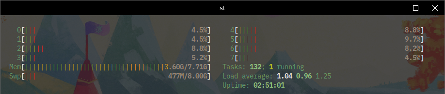

## Material decorations for KDE

Material-ish window decoration theme for KWin.

### Installation

#### Prerequisites

* a compiler like (g++ or gcc)
* make
* cmake
* extra-cmake-modules
* KDecoration2
* Qt5
* KF5Config
* Qt5Core
* KF5CoreAddons
* Qt5Gui
* KF5GuiAddons
* KF5WindowSystem
* KF5

#### Installing compilation dependencies

```
sudo xbps-install ecm-devel extra-cmake-modules qt5-devel kdecoration-devel kconfig-devel kguiaddons-devel kwindowsystem-devel
```

#### Building from source

Download or clone this repository and then run the following commands on the terminal inside that directory.

```
mkdir build
cd build
cmake -DCMAKE_BUILD_TYPE=Release ../
make
sudo make install
```
